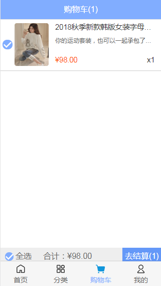

# mall

项目技术：

vuecli4 + webpack + vue + vuex + vue-router + axios
 
 
接口说明：

接口不是我本人的，后台所有数据由coderwhy老师提供，
想要完整接口的同学可以加老师的微信（老师微信：coderwhy001），
修改request.js文件中的接口地址就可以把项目跑起来了
  
  
项目截图





## Project setup
```
npm install
```

### Compiles and hot-reloads for development
```
npm run serve
```

### Compiles and minifies for production
```
npm run build
```

### Customize configuration
See [Configuration Reference](https://cli.vuejs.org/config/).
